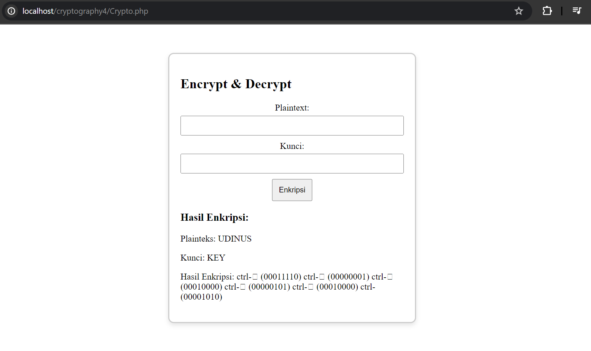
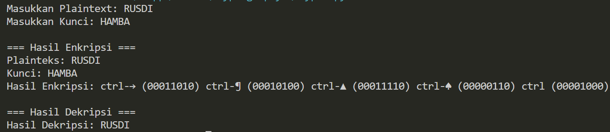

# Kriptografi
# One Time Pad
## Enkripsi-Dekripsi
<body>
    <table border="1">
        <tr>
            <th> Nama</th>
            <th>NIM</th>
            <th>Kelas</th>
        </tr>
        <tr>
            <td>Billy Alfauzi Caesar</td>
            <td>312110152</td>
            <td>TI.21.A.1</td>
        </tr>
    </table>
</body>

## Enkripsi Menggunakan PHP

1. Fungsi Konversi ASCII:
konversiAscii($input_string): Mengonversi setiap karakter dalam string menjadi nilai ASCII dan menyimpannya dalam bentuk array.
Fungsi XOR Biner:

2. xorBiner($biner1, $biner2): Melakukan operasi XOR pada dua string biner dan mengembalikan hasilnya dalam bentuk string biner.
Fungsi Biner ke Desimal:

3. binerKeDesimal($biner): Mengonversi string biner menjadi nilai desimal.
Fungsi Kode ASCII:

4. kodeAscii($ascii_code): Mengembalikan karakter ASCII yang sesuai dengan nilai ASCII yang diberikan.

5. Proses Enkripsi:
- Pengguna diminta untuk memasukkan plaintext dan kunci melalui formulir HTML.
- Plaintext dan kunci dikonversi ke dalam nilai ASCII.
- Dilakukan operasi XOR antara ASCII Plaintext dan ASCII Kunci.
- Hasil XOR dikonversi ke dalam nilai desimal.
- Hasil desimal dikonversi ke dalam karakter ASCII.
- Hasil enkripsi ditampilkan dalam format tertentu di dalam kartu.

6. Proses Dekripsi:
- Operasi XOR kembali dilakukan antara hasil desimal dan ASCII Kunci.
- Hasil XOR dikonversi ke dalam karakter ASCII.
- Hasil dekripsi ditampilkan di dalam kartu.

7. Penanganan Karakter Khusus:
Fungsi formatEnkripsiCharacter digunakan untuk menangani karakter khusus dengan nilai ASCII kurang dari 32 agar dapat ditampilkan dengan format yang sesuai.

8. Escape HTML Entities:
Fungsi htmlspecialchars digunakan untuk menghindari masalah HTML rendering saat ada karakter khusus pada tampilan plaintext.
Kesimpulan:

> [!NOTE]
> Algoritma XOR digunakan untuk enkripsi dan dekripsi. Hasil enkripsi dan dekripsi ditampilkan dalam format tertentu di dalam kartu.
>Karakter khusus dengan nilai ASCII kurang dari 32 diatasi agar dapat ditampilkan dengan format yang sesuai di HTML.

## Enkripsi Menggunakan PYTHON

1. Fungsi Konversi ASCII:
konversiascii(input_string): Mengonversi setiap karakter dalam string menjadi nilai ASCII dan menyimpannya dalam bentuk list.

2. Fungsi XOR Biner:
xor_biner(biner1, biner2): Melakukan operasi XOR pada dua string biner dan mengembalikan hasilnya dalam bentuk string biner.
Fungsi Biner ke Desimal:

3. biner_ke_desimal(biner): Mengonversi string biner menjadi nilai desimal.
Fungsi Kode ASCII:

4. kodeascii(ascii_code): Mengembalikan karakter ASCII yang sesuai dengan nilai ASCII yang diberikan.

5. Proses Enkripsi:
- Pengguna diminta untuk memasukkan plaintext dan kunci.
- Plaintext dan kunci dikonversi ke dalam nilai ASCII.
- Dilakukan operasi XOR antara ASCII Plaintext dan ASCII Kunci.
- Hasil XOR dikonversi ke dalam nilai desimal.
- Hasil desimal dikonversi ke dalam karakter ASCII.
- Hasil enkripsi ditampilkan dalam format tertentu.

6. Proses Dekripsi:
- Operasi XOR kembali dilakukan antara hasil desimal dan ASCII Kunci.
- Hasil XOR dikonversi ke dalam karakter ASCII.
- Hasil dekripsi ditampilkan.

> [!NOTE]
> Hasil enkripsi ditampilkan dalam format tertentu, termasuk karakter kontrol untuk nilai ASCII di bawah 32.

## Done

# Panjang Umur Untuk Semua Hal-Hal Baik
